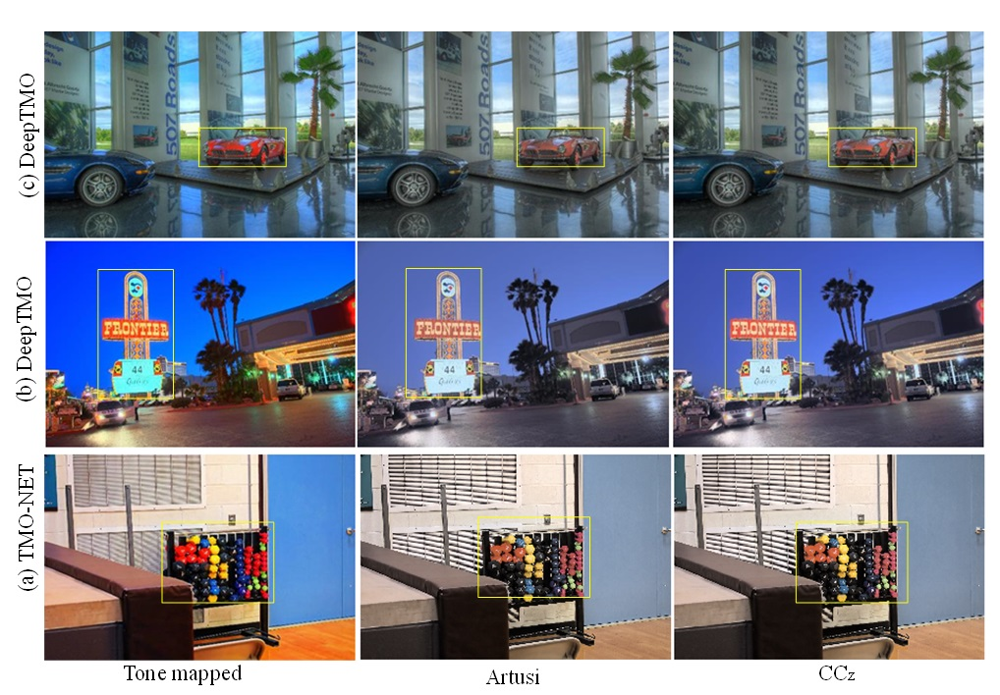
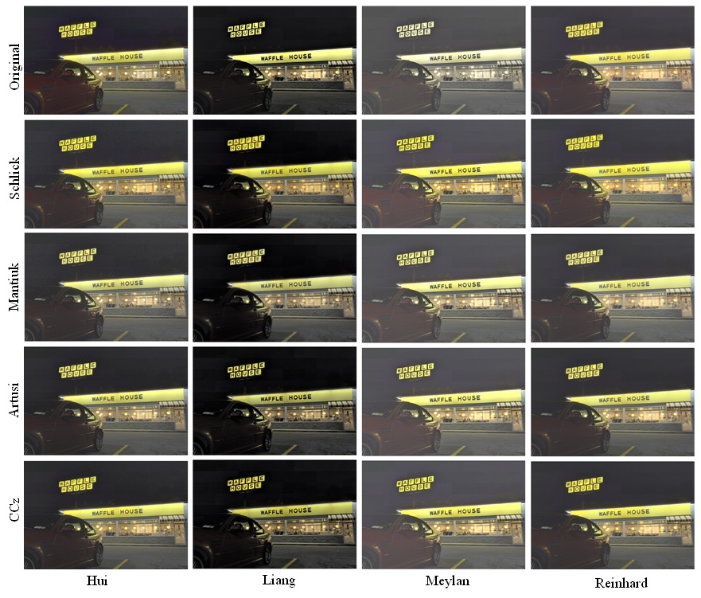

# Generic Color Correction for Tone Mapping Operators in High Dynamic Range Imaging

## Abstract

One of the significant challenges in tone mapping is to preserve the perceptual quality of the tone-mapped images. Traditional tone mapping operators (TMOs) compress the luminance of high dynamic range (HDR) images with little to no consideration of image color information, resulting in suboptimal colors. Existing color management algorithms require either manual parameter tuning or introduce lightness and hue shifts. This study aims to develop a color correction model in plausible agreement with the psychophysical phenomenon of color appearance perception for optimal color reproduction of tone-mapped images. The proposed model leverages CIECAM16 perceptual correlates, i.e., lightness, chroma, and hue. It is adaptive and entirely automatic, while preserving the lightness of the tone-mapped image and maintaining the hue from the HDR image. Moreover, it does not require any gamut mapping correction algorithm in natural color reproduction. The effectiveness of the model was validated using objective and subjective methods. The experiments revealed that the model achieved optimal color reproduction in terms of naturalness of the colors.

## Introduction

The real-world luminance range can be mapped to the display luminance range using a variety of specialized TMOs. These TMOs compress the brighter parts while manipulating darker tones to appear brighter, which generally distorts the color contrast relationship. Most common TMOs focus on maintaining the ratios of the color channels and try to manipulate luminance, resulting in over-saturation of the tone-mapped image.

The proposed color correction model (CCz) aims to reproduce hue and chroma from the HDR image, preserving the lightness of the tone-mapped image.

## Proposed Color Correction Model

The input to the color correction model (CCM) comprises of tone-mapped image \(I_t\) and corresponding original HDR image \(I_o\). The model is based on CIECAM16 for the computation of perceptual correlates: lightness, chroma, and hue.

### Workflow

### Steps

1. **Calculate Lightness of Tone Mapped Images**
2. **Color Adaptation from HDR Image**
3. **Calculate Hue Angle and New Chroma**
4. **Display Image Transformation**

## Results

### Visual Comparisons

The model's effectiveness can be evaluated using both objective and subjective methods. Below are some examples of the results obtained from our color correction model.

#### Example 1: Color Corrected Image

#### Example 2: Color Corrected Image

#### Example 3: Color Corrected Image

#### Example 4: Color Corrected of Masked Images

### Psychophysical Performance of CCMs

The performance of various color correction models was compared. The results indicated that CCz consistently outperformed other models in terms of natural color reproduction.
A paired comparison based psychophysical experiment was conducted to test and compare the performance of CCz with other models. The results showed that CCz produced significantly better and more natural color reproduction for tone-mapped images.

## Conclusions

A generic color correction model CCz was proposed to address the issues of color distortions in tone mapping. It utilizes CIECAM16 to compute perceptual correlates, providing a robust framework for more optimal color adaptation.

## Acknowledgments

The authors thank Dr. Mark Fairchild for providing the HDR image database and Dr. Rafal Mantiuk for providing HDR images.

## Data Availability

Data underlying the results presented in this paper are available in Ref. [21].

## License

This project is licensed under the MIT License. See the [LICENSE](LICENSE) file for details.

## Cite

Mehmood, I., Khan, M. U., & Luo, M. R. (2024). Generic color correction for tone mapping operators in high dynamic range imaging. Optics Express, 32(16), 27849-27866.
